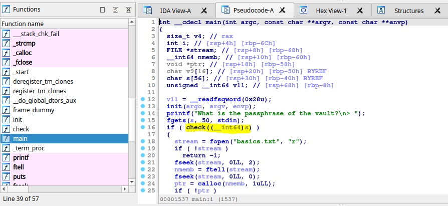
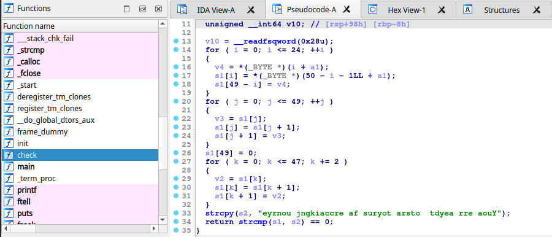
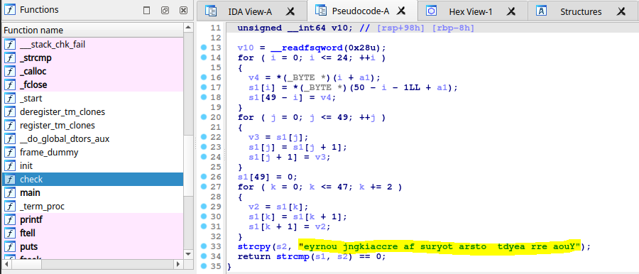
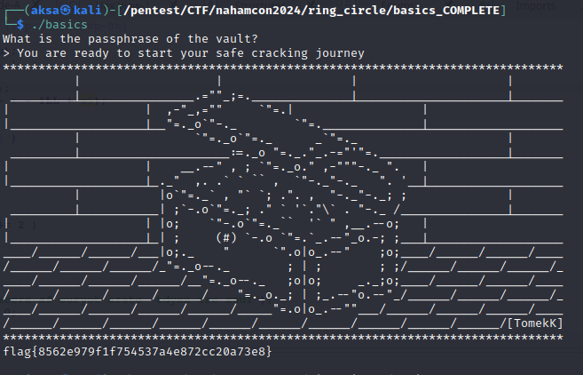

# Ring Cycle - Basics
## Description
170 points - Reverse Engineering - 258 Solves - easy
Author: @awesome10billion

Let us start with a simple one and see if you can break into this vault.

NOTE, the plaintext that you provide the binary should be readable English. Reverse engineer the binary to understand what it really does... patching the binary will ultimately give you the wrong answer.

## Solution
Langsung saja kita bedah isi dari program `basics` menggunakan software `IDA` dan melihat bentuk pseudocode dari main function nya. Disini kita dapat lihat bahwa terdapat pengecekan input pengguna sebelum nantinya proses di dalam if statement dijalankan.


Oleh karena itu kita coba buka pseudocode dari function `check`.<br/>


Dari function tersebut terlihat bahwa input pengguna nantinya akan di tukar - tukar posisi karakter nya hingga sesuai dengan karakter pembandingnya yaitu `eyrnou jngkiaccre af suryot arsto  tdyea rre aouY`.


Kita dapat me rekonstruksi fungsi `check` ke dalam bahasa program lain semisal python lalu menggunakan algoritma pada fungsi check secara terbalik untuk mendapatkan susunan text valid untuk di inputkan nantinya. Berikut ini script python nya.
```python
def check_reverse(s2):
    for k in range(0, len(s2)-2, 2):
        v2 = s2[k]
        s2[k] = s2[k + 1]
        s2[k + 1] = v2
    s2.reverse()
    return ''.join(s2)

print(check_reverse(list("eyrnou jngkiaccre af suryot arsto  tdyea rre aouY")))
```

Lalu kita coba masukan hasil reverse karakter nya di program dan voila flag berhasil didapatkan.

