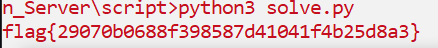

# Encryption Server
## Description
308 points - Cryptography - 198 Solves - medium
Author: @Jstith

I read online it's bad to re-use the prime numbers in RSA. So, I made this server that randomly generates them for me.

## Solution
Challenge kali ini kita diberikan file `RSA_Encryption_Server.py` yang digunakan untuk menghasilkan `ciphertext` RSA dari pengguna dan juga menampilkan `ciphertext` RSA dari flag.
```python
#!/usr/bin/python3

from secrets import randbits
from sympy import nextprime
import random

e = random.randint(500,1000)

def encrypt(inp):
        p = nextprime(randbits(1024))
        q = nextprime(randbits(1024))
        n = p * q
        c = [pow(ord(m), e, n) for m in inp]
        return [n, c]

def main():

        while True:
                print('Welcome to the Really Shotty Asymmetric (RSA) Encryption Server!')
                print('1: Encrypt a message')
                print('2: View the encrypted flag')
                print('3: Exit')

                inp = ''
                while (not ('1' in inp or '2' in inp or '3' in inp)):
                        inp = input('> ')

                if('3' in inp):
                        print('Goodbye!')
                        exit()

                elif('1' in inp):
                        plain = input('Enter a message, and the server will encrypt it with a random N!\n> ')
                        encrypted = encrypt(plain)

                elif('2' in inp):
                        data = open('flag.txt', 'r').read()
                        data = data.strip()
                        encrypted = encrypt(data)

                print('Your randomly chosen N:')
                print(f'> {encrypted[0]}')
                print('Your encrypted message:')
                print(f'> {encrypted[1]}')
                print('\n')

if(__name__ == '__main__'):
        main()
```

Untuk dapat melakukan decrypt ciphertext flag, kita dapat mengamati terlebih dulu celah pada program yang digunakan untuk enkripsi RSA. <br/>
Kita dapat lihat bahwa enkripsi diterapkan satu per satu pada setiap karakter flag. Juga, kemungkinan angka yang dipakai untuk nilai eksponen (`e`) di sekitar 500 angka mulai dari `500 hingga 1000`.


Mengetahui cara kerja program, kita dapat men-decrypt `ciphertext` flag dengan cara bruteforce satu per satu kemungkinan nilai eksponen (`e`) dengan menggunakan pembanding untuk karakter awal dari format flag yaitu huruf `f`. Sehingga, setelah mendapat nilai eksponen (`e`) yang betul maka cukup bruteforce kemungkinan karakter flag dengan melakukan enkripsi secara berulang ke setiap kemungkinan karakter flag dan mencocokannya dengan `ciphertext`. Berikut merupakan script untuk decrypt data.
```python
from Crypto.Util.number import *

n = <nilai n ciphertext flag>
c = [<nilai ciphertext dari per karakter flag>]

def decrypt(n, c):
    pt = []
    e = 0
    #pow(ord(m), e, n)
    for x in range(len(c)):
        if x == 0:
            for i in range(500,1000):
                tmp = pow(ord('f'), i, n)
                if tmp == c[0]:
                    e = i
                    break
        for i in range(128):
            tmp = pow(i, e, n)
            if tmp == c[x]:
                pt.append(chr(i))
                break

    return pt

result = decrypt(n, c)
print(''.join(result))
```

Note: Nilai N dan C didapat dari koneksi `nc <ip server> <port server>` yang disediakan dari soal. <br/>

Voila kita berhasil mendapatkan data flag.

