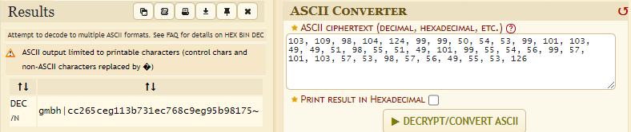
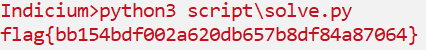

# Indicium
## Description

157 points - Machine Learning - 263 Solves - medium
Author: @kkevsterrr

Rwa Kuv, if you catch my drift.

103, 109, 98, 104, 124, 99, 99, 50, 54, 53, 99, 101, 103, 49, 49, 51, 98, 55, 51, 49, 101, 99, 55, 54, 56, 99, 57, 101, 103, 57, 53, 98, 57, 56, 49, 55, 53, 126

## Solution
Untuk menyelesaikan soal ini kita perlu tau kalau angka yang ditampilkan pada deskripsi soal merupakan angka desimal ASCII.

Tapi ketika dicoba mengubah angka tersebut ke string ASCII menghasilkan teks yang belum mendekati flag.


Namun setelah diamati secara seksama, karakter yang muncul seperti `gmbh` bila mundur satu karakter ke belakang maka akan menjadi `flag`. Nah, berhubung format flag diawali dengan kata `flag` maka artinya kita bisa mendapatkan flag dengan cara mundur satu karakter ke belakang disetiap karakter tadi. <br/>

Untuk mempermudah proses mendapatkan flag, saya telah membuat program untuk hal tersebut.
```python
cipher = [103, 109, 98, 104, 124, 99, 99, 50, 54, 53, 99, 101, 103, 49, 49, 51, 98, 55, 51, 49, 101, 99, 55, 54, 56, 99, 57, 101, 103, 57, 53, 98, 57, 56, 49, 55, 53, 126]

key = 1

pt = [chr(x - 1) for x in cipher]

flag = ''.join(pt)

print(flag)
```

Selanjutnya hanya perlu menjalankan program tersebut dan voila flag berhasil didapatkan.

