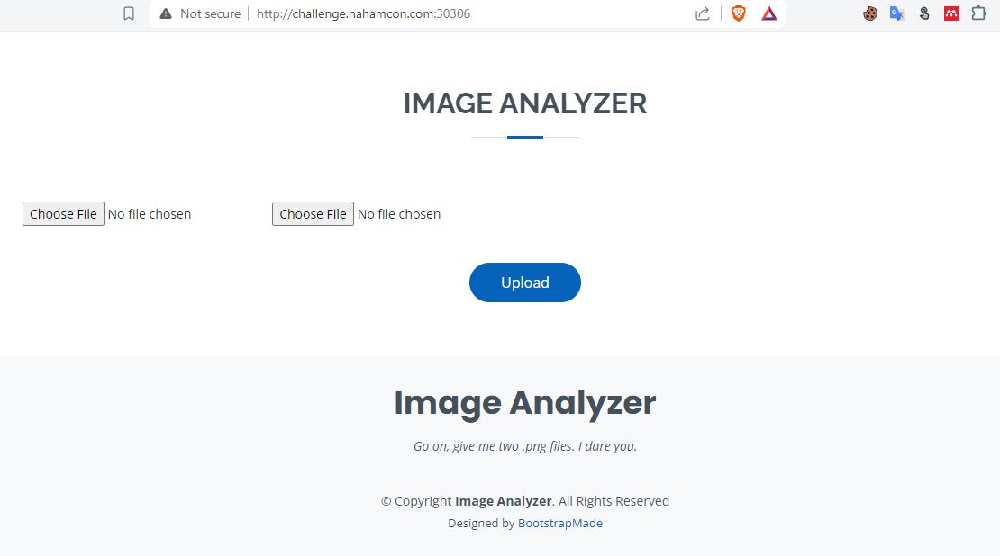
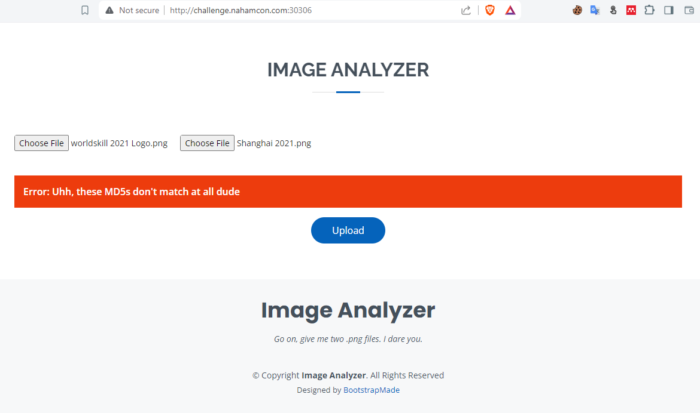
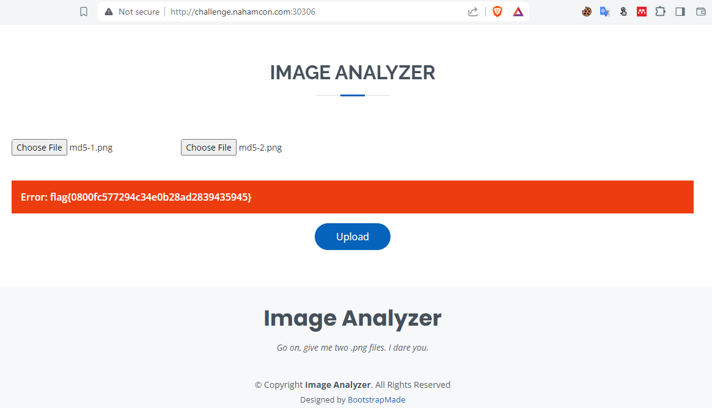

# Not Quite The Same
## Description
50 points - Miscellaneous - 337 Solves - medium
Author: @Kkevsterrr#7469

Everyone knows MD5 hashes. Everyone knows .png files! I believe you'll collide with greatness.

## Solution
Pada soal ini kita diberikan sebuah web yang menyediakan input dua file png.

Saat kita mencoba memasukan sembarang file png akan muncul pesan bahwa file yang kita masukan perlu memiliki nilai hash MD5 yang sama. Nilai hash sendiri digunakan untuk memastikan integritas sebuah file. 

Umumnya, nilai hash disetiap file akan berbeda - beda namun pada beberapa algoritma hash salah satunya MD5 terdapat kelemahan yang bernama `collision hash`. Kelemahan ini menyebabkan dua atau lebih file memiliki nilai hash yang sama.  
Untuk mendapatkan file PNG yang telah memiliki hash MD5 yang sama, kita dapat menggunakan repository <a href="https://github.com/corkami/collisions/blob/master/examples/free/README.md">ini</a>. Lalu kita coba masukan dua file PNG dengan nilai hash yang sama dan voila flag berhasil kita dapat.

