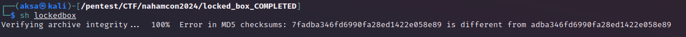
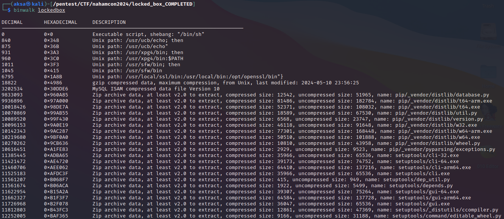
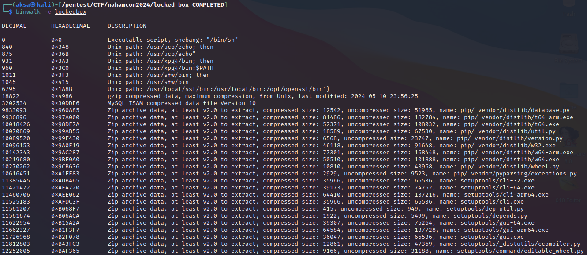
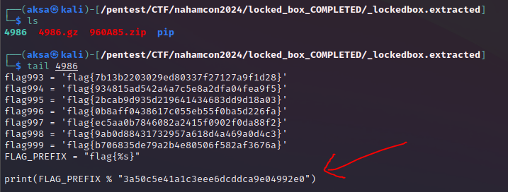

# A Locked Box
## Description
351 points - Reverse Engineering - 174 Solves - medium
Author: @Kkevsterrr#7469

I've got a box, but I think I've misplaced the key.

## Solution
Awalnya saya coba menjalankan `lockedbox` seperti pada challenge sebelumnya (`whats in the box`), namun ternyata terdapat fungsi pencocokan nilai hash pada program yang membuat program ini tidak bisa dijalankan.

Lalu saya coba berpikir kalau challenge ini tidak jauh dari challenge sebelumnya berarti ada embedded file di challenge ini. Jadi saya coba cek pakai `binwalk` untuk mengetahui apakah ada file embedded atau tidak.

Untuk mendapatkan flag dari challenge ini dengan cara mengekstrak embedded file menggunakan `binwalk` dan flag bisa ditemukan pada baris terakhir salah satu file hasil ekstraksi.

