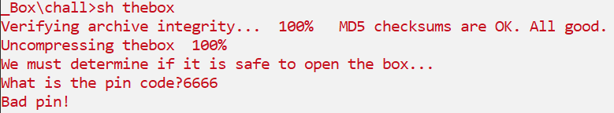
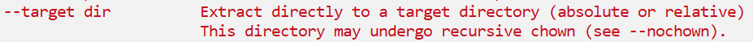
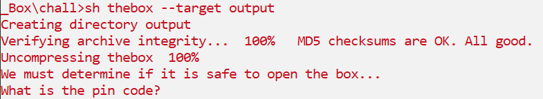
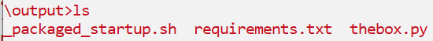
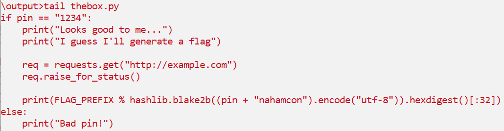
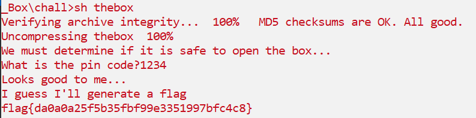

# Whats In The Box?
## Description
241 points - Reverse Engineering - 229 Solves - medium
Author: @Kkevsterrr#7469

I've got a box, and I just know there's a flag inside.

## Solution
Pada soal ini kita diberikan file `thebox` yang merupakan file compiled script POSIX files (sederhananya compile dari program berbasis bash). Kalau kita coba jalankan file maka nantinya kita akan diminta memasukan kode pin yang valid.

File ini jika kita coba lihat isinya maka kita dapat melihat bahwa program memiliki fitur `help`. Dan bila kita coba lihat salah satu opsi yang bisa kita tambahkan di belakang `thebox` adalah `--target dir`. Opsi tersebut memungkinkan kita menentukan target direktori untuk tempat file hasil ekstrak dari `thebox` akan disimpan.

Kita dapat coba menjalankan `sh thebox --target output` sehingga nantinya file embedded dari `thebox` akan tersimpan pada folder `output`. 

Sambil tetap menjalankan `thebox` kita dapat cek isi dari folder `output`.

Lalu kita dapat cek isi dari file `thebox.py` dan kita dapati bahwa program akan menampilkan flag asli bila kita memasukan pin code `1234`.

Terakhir, kita coba saja untuk memasukan code pin dan voila flag berhasil didapat.

