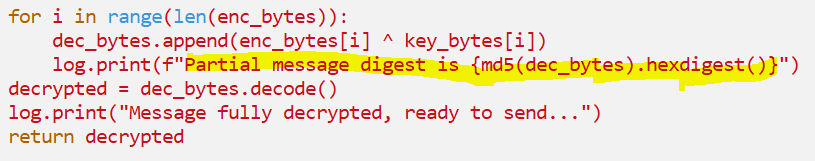

# Hashes on Hashes on Hashes
## Description

310 points - Scripting - 196 Solves - medium
Author: @Jstith

I created a server to manage all my encrypted data from my lucrative ransomware business. It's still in development, but I should be okay as long as.. wait, what? Somebody leaked a log file??

## Solution
Pada soal ini kita diberikan dua file yaitu `decryption_server.log` dan `server.py`.<br/>
File `server.py` memiliki fungsi utama sebagai tempat menerima data ter-enkripsi yang nantinya di decrypt dan log aktivitas nya disimpan pada file `decryption_server.log`.
```python
import socket
import base64
from hashlib import md5
from datetime import datetime

host = '0.0.0.0'
port = 9001

class log:
    @staticmethod
    def print(message):
        with open('./decryption_server.log', 'a') as f:
            now = datetime.now()
            f.write(now.strftime("%d/%m/%Y %H:%M:%S") + "\t")
            f.write(message + '\n')

def decrypt(encrypted):
    key = open('key.txt').read()
    key = key.strip()
    log.print("Key loaded for encrypted message")

    factor = len(encrypted) // len(key) + 1
    key = key * factor
    log.print(f"Key expanded by factor of {factor}")
    key_bytes = key.encode()

    enc_bytes = base64.b64decode(encrypted)
    dec_bytes = bytearray()

    for i in range(len(enc_bytes)):
        dec_bytes.append(enc_bytes[i] ^ key_bytes[i])
        log.print(f"Partial message digest is {md5(dec_bytes).hexdigest()}")
    decrypted = dec_bytes.decode()
    log.print("Message fully decrypted, ready to send...")
    return decrypted

def main_loop():

    s = socket.socket(socket.AF_INET, socket.SOCK_STREAM)
    s.bind((host, port))
    log.print(f"Server listening on host {host} and port {port}")

    while True:
        s.listen(1)
        log.print("Listening for connection...")

        c_soc, addr = s.accept()
        log.print(f"Connection received from {addr}")

        ciphertext = c_soc.recv(1024).decode().strip()
        log.print(f"Received encrypted message {ciphertext}")

        plaintext = decrypt(ciphertext)
        c_soc.sendall(plaintext.encode())
        log.print(f"Decrypted message sent!")


if __name__ == '__main__':
    main_loop()
```

Dari program `server.py`, kita dapat tau bahwa terdapat fungsi bernama `print` yang akan mencetak setiap pesan yang di inputkan ke fungsi tersebut dan menyimpannya ke file log.


Lalu bila kita teliti lebih ke dalam file program dapat diketahui ketika proses decrypt berlangsung, setiap hasil decrypt akan di cetak (`print`) dengan menampilkan hasil hash md5 dari array yang menampung data asli (`plaintext`).


Kemudian untuk memperoleh data asli (`plaintext`) dari file log, kita dapat brute force setiap kemungkinan karakter yang bisa muncul pada data flag. <br/>
Berikut merupakan script yang dipakai untuk merecover `plaintext` dari md5 digest di file log.
```python
from hashlib import md5

data = open('../chall/decryption_server.log', 'r').readlines()

digests = []
tmp = []
for line in data:
    if "Partial" in line:
        tmp.append(line.split()[-1])
    elif "Message fully" in line:
        digests.append(tmp)
        tmp = []

data_arr = []
tmp_arr = bytearray()

for r in range(len(digests)):
    if len(data_arr) == 0 and len(tmp_arr) != 0:
        data_arr.append(tmp_arr)
        tmp_arr = bytearray()
    if len(data_arr) != 0:
        data_arr.append(tmp_arr)
        tmp_arr = bytearray()
    for c in range(len(digests[r])):
        for i in range(128):
            tmp_arr.append(i)
            tmp = md5(tmp_arr).hexdigest()
            if tmp == digests[r][c]:
                break
            else:
                tmp_arr.pop()

for i in data_arr:
    print(i.decode())
```

Perlu diperhatikan bahwa disetiap hash yang dihasilkan merupakan hash dari `bytearray` yang artinya setiap `bytearray` terisi dengan data `plaintext` yang baru maka nantinya nilai dari hash akan berubah. Sehingga, pada script diatas akan menambahkan `plaintext` yang sudah benar ke `tmp_arr` yang kemudian ditambahkan ke `data_arr` bila terbukti valid. Nantinya array `data_arr` lah yang akan diambil nilai hash nya untuk dibandingkan dengan nilai hash lainnya di file log. <br/>
Ketika script tadi dijalankan maka hasil `plaintext` seperti berikut.


