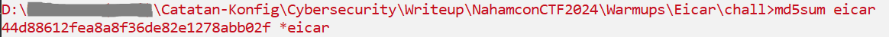

# Eicar
## Description
50 points - Warmups - 1878 Solves - easy
Author: @JohnHammond

What is the MD5 hash of this file?

Wrap the hexadecimal value in the flag{ prefix and { suffix to match the standard flag format.

Note, your antivirus engine might flag this file -- don't worry, I promise it's not malware :)

## Solution
Soal ini meminta kita untuk mendapatkan nilai `hash MD5` dari file `eicar`. Langsung saja kita generate nilai `hash MD5` dengan menggunakan perintah `md5sum` di Windows.

Lalu kita tinggal masukan ke format flag jadi flag yang valid.
flag{44d88612fea8a8f36de82e1278abb02f}
