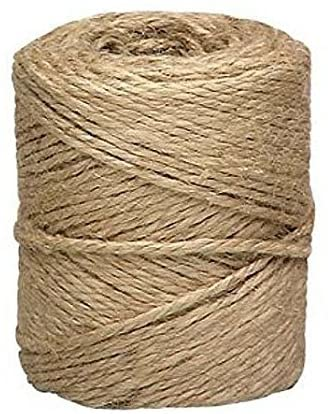

Kami di berikan sebuah chall yaitu gambar di atas
dan kami disuruh mencari FLAG nya, maka langkah yang kami lakukan pertama, adalah melihat file tersebut
lalu kami membongkar gambar itu menggunakan binwalk
dengan hasil

Terlihat di atas terdapat 2 file yang dimana ada file 0 dan 870E
lalu kami lihat file nya menggunakan strings
dan hasil nya seperti ini

Maka kami simpulkan flag nya adalah

FLAG: flag{4ac54e3ba5f8f09049f3ad62403abb25}
