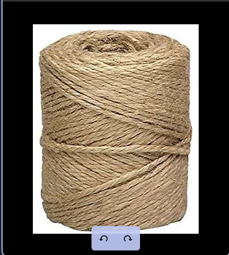
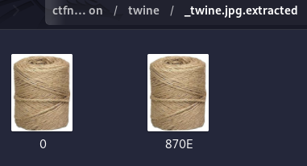
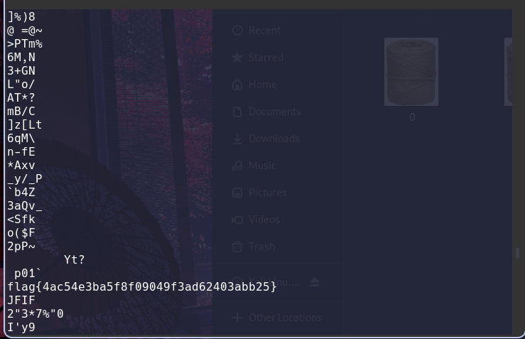

# Twine
## Description
50 points - Warmups - 1736 Solves - easy
Author: @JohnHammond#6971

Google tells me that twine means: "strong thread or string consisting of two or more strands of hemp, cotton, or nylon twisted together."

## Solution
  
Kami di berikan sebuah chall yaitu gambar di atas
dan kami disuruh mencari FLAG nya, maka langkah yang kami lakukan pertama, adalah melihat file tersebut
lalu kami membongkar gambar itu menggunakan binwalk
dengan hasil.  

Terlihat di atas terdapat 2 file yang dimana ada file 0 dan 870E
lalu kami lihat file nya menggunakan strings
dan hasil nya seperti ini.

Maka kami simpulkan flag nya adalah

FLAG: flag{4ac54e3ba5f8f09049f3ad62403abb25}
