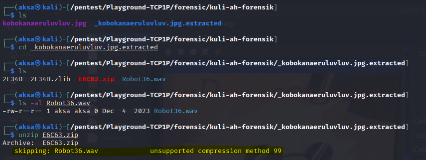

# kuli-ah forensik
## Description

20 pts - Forensic

Author: fire

I just created secret message in image file but i want to make it secure so i transform it to audio file. But i think it's not secure enough so i archive it with password. I encrypt it with very strong password. I'am sure no one can crack it because my password is random 15 digit number in base 3. It's very very secure right? ... right??. Then i wrap my file within an image so no one can realize.

flag = TCF2024{ < my secret message > }

## Solution

Step by step:
1. Semisal kita cek tipe file yang kita dapat itu file gambar biasa, tapi ketika kita lihat isi binary filenya dengan `binwalk` diketahui kalau ada beberapa file yang ter-<i>embedded</i> di dalam file gambar itu.

    

2. Langsung aja di extract pakai perintah `binwalk -e <nama_file>`

    

3. Hasil dari extractnya akan tersimpan pada folder dengan format nama `_<nama_file>.extracted`. Kalau kita cek maka akan ada file zip yang berhasil kita dapatkan dari `binwalk`.

    

4. Ketika dicoba extract zip pada langkah sebelumnya terjadi error (gagal) dan bila kita cek tipe file nya dengan perintah `file <nama_file>` maka bisa diketahui kalau file ZIP ini diberikan password yang ditandai adanya informasi penggunaan `compression method AES`.

    

5. Kalau dicoba extract maka akan seperti ini kurang lebih.

    

6. Lalu kita coba crack saja. Tapi sebelum itu kita butuh informasi password list nya. Deskripsi soal telah memberikan informasi tentang format password yang terdiri dari 15 digit dengan angka yang digunakan adalah angka - angka dari basis 3 yaitu angka 0, 1, dan 2.

7. Lewat informasi itu kita bisa membuat `custom password list` dengan bantuan tools `crunch`. Untuk membuatnya kita perlu menyediakan panjang minimal password (warna merah), maksimal panjang password (warna biru), angka yang dipakai di password alias konten pw nya (warna kuning), dan nama file list password nya nanti di save (warna hijau)

    

8. Kurang lebih nanti isinya akan seperti ini.

    

9. Berikutnya kita bisa mulai saja crack. Tapi pertama kita perlu generate dulu hash dari file ZIP nya sesuai format John (tools untuk crack nya).

    

10. Kalau sudah di generate baru kita mulai proses crack password.

    

11. Dengan password yang didapat, kita bisa mengextract file ZIP dan mendapati file audio WAV.

12. Semisal dicoba buka file WAV nya, nanti akan bisa didengar nada - nada aneh yang sekilas mirip Morse tapi itu <strong>bukan Morse Code</strong>. Melainkan sebuah audio <a href="https://en.wikipedia.org/wiki/Slow-scan_television">SSTV</a> yang biasanya dipakai untuk transmisi gambar/citra lewat signal radio (TV).

13. Untuk men-<i>decode</i> SSTV kita bisa pakai tools seperti `qsstv` di linux atau `rx-sstv` di windows.

14. Kalau saya pakai `qsstv`. Cara pakainya cukup di install aja dan buka/jalankan tools `qsstv` nya. Sambil program `qsstv` terbuka, di window lain kita jalankan file WAV nya. Nah, nanti audio yang dikeluarkan oleh file WAV yang terdeteksi sama `qsstv` nantinya akan di decode hingga menghasilkan sebuah gambar.

15. Flag pun berhasil didapatkan.

    
