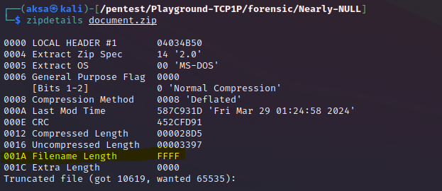
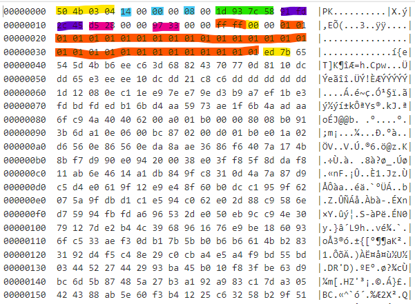
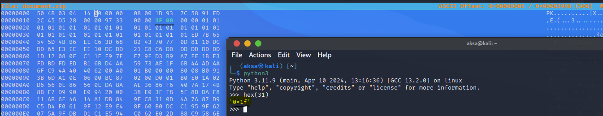
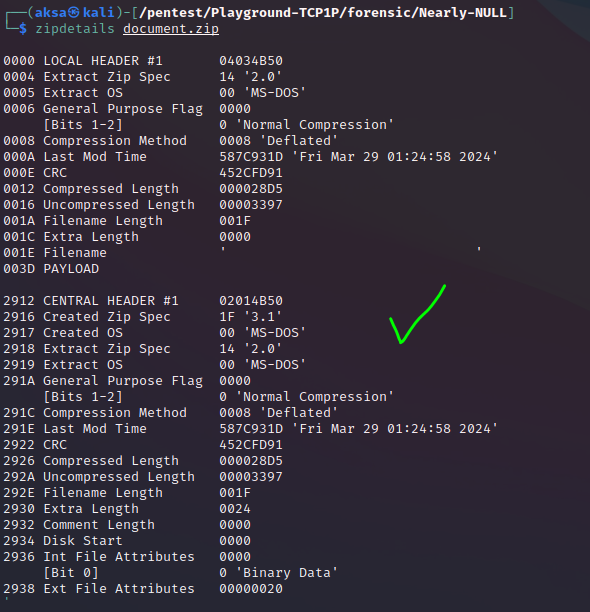
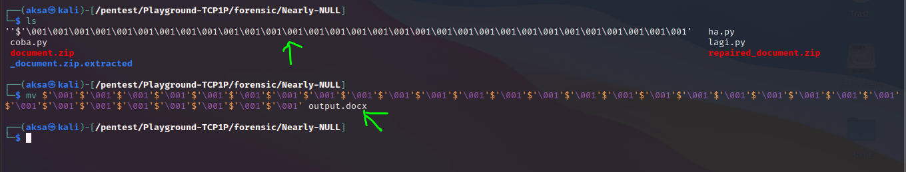
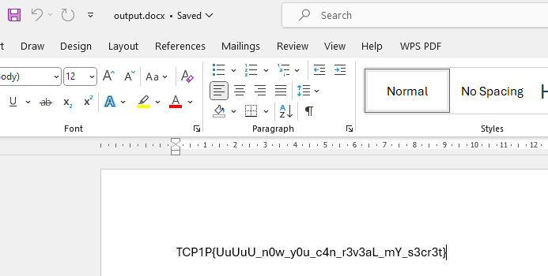

# Nearly NULL
## Description

20 pts - Forensic

Author: cipichop

I have a document to be reviewed, but i cannot even extract it from the archive.

## Solution

Step by step:

1. Kita dikasih file archive ZIP. Semisal kita coba extract akan memunculkan pesan error berupa file corrupt.

2. Berbekal info itu kita bisa check detail bytes chunk dari file ZIP dengan tools `zipdetails`.

   

3. Dari informasi itu kita bisa tahu letak kesalahannya ada di masalah truncating data yang tidak tepat.

4. Kalau kita bedah isi dari file nya dengan `hexdump` nanti akan berisi seperti ini. Info yang ditampilkan berisi informasi berikut sesuai urutan blok:
  *  Blok pertama (warna kuning)   : Signature Byte Header ZIP <i>(0x504B0304)</i>
  *  Blok kedua   (warna nila)     : Versi <i>(0x14 atau 20 decimal yang artinya versi 2.0)</i>
  *  Blok ketiga  (warna nila)     : Flag opsi kompresi file <i>(0x02)</i>
  *  Blok keempat (warna nila)     : Metode kompersinya <i>(0x08 alias <a href="https://en.wikipedia.org/wiki/Deflate">deflated</a>)</i>
  *  Blok kelima  (warna hijau)    : Waktu modifikasi (2 byte awal untuk jam dan 2 byte berikutnya untuk tanggalnya)
  *  Blok keenam  (warna ungu)     : CRC-32 Checksum yang intinya nilai hash untuk verifikasi integrasi data alias memastikan data tidak corrupt <i>(0x91fd2c45)</i>
  *  Blok ketujuh (warna magenta)  : Compressed size <i>(0xd528 = 54568 bytes)</i>
  *  Blok kedelapan (warna magenta): Uncompressed size <i>(0x9733 = 38707 bytes)</i>
  *  Blok kesembilan (warna orange): Panjang Nama File <i>(0xffff = 65535 karakter)</i>
  *  Blok kesepuluh (warna kuning) : Panjang blok tambahan <i>(0x00 = 0)</i>
  *  Blok kesebelas (warna orange) : Nama File (intinya nama file ini tuh NULL yang byte nya 0x01 di kasus soal ini). Nah, soal panjang pendeknya itu sebenernya ngikutin info dari `blok kesembilan` namun karena ini corrupt jadi kita bisa jadikan ini sebagai clue.
  *  Blok kesepuluh (warna kuning)  : Aslinya di file ini tuh ngga ada field/blok tambahan, tapi kalau ada maka panjang bytes nya akan sesuai dengan info di blok kesepuluh. (yang digambar itu contoh aja semisal ada maka disitu posisi bloknya)

    

    Note: soal kenapa tulisan hex di `zipdetails` beda sama yang di list tadi itu karena yang list itu make acuan `hexdump` yang formatnya `big-endian` sementara `zipdetails` make format hex `little-endian`.

5. Dari informasi file ZIP nya kita bisa curiga kalau corrupt nya terjadi di sektor `panjang nama file`, hal ini karena tidak logis saja jika nama file punya panjang karakter 65535. Terlebih lagi, nama file yang tersedia pada file ZIP saat ini hanya NULL character yang mungkin ditujukan sebagai hint ke panjang aslinya.

6. Kita coba ubah saja pakai `hexeditor` menjadi panjang yang sesuai dengan panjang dari nama file yang ditunjukan dari seberapa banyak bytes NULL characternya yaitu 0x1f (31 bytes).

  

7. Lalu kita save dan kita cek lagi dengan `zipdetails`. Yup, file ZIP berhasil diperbaiki.
  

8. Selanjutnya kita extract saja dan nanti dari hasil extract nya kita akan mendapati file dengan nama hanya NULL character saja. Untuk tau jenis file aslinya kita bisa pakai perintah `file <nama_file>`, contoh `file aku.txt`

9. Setelah itu akan didapati bahwa jenis file adalah `docx`. Kita tinggal buka saja dengan program yang sesuai (misal: Microsoft Word). Flag pun didapatkan.

  

  

## Referensi
* https://ctftime.org/writeup/36731
* https://github.com/pmqs/zipdetails/blob/main/bin/zipdetails
