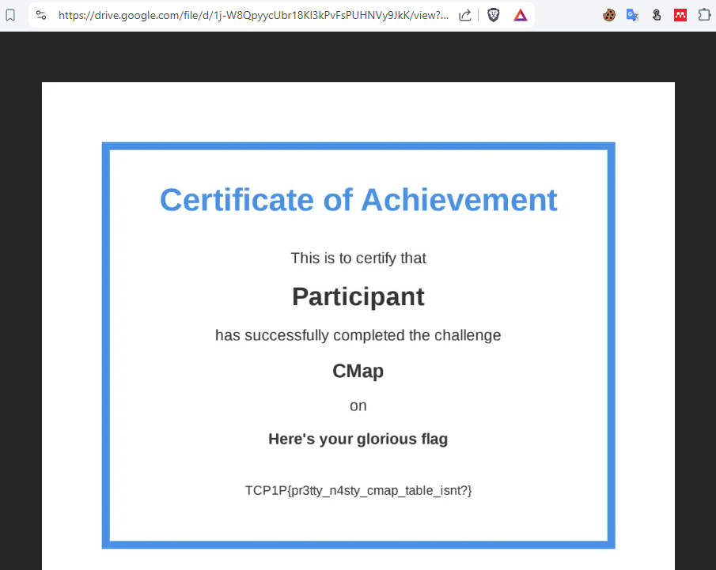

# CMAP
## Description
1000 points - Misc

Author: nagi
<div style="text-align: justify">A friend of mine said he had installed a peculiar font on my system. However, it looked pretty much the same when I tried to use it. After a while, he confessed that he had been messing around with the mapping table, making it possible to store a certain amount of information on it</div>

Hint: `A single-font may come with multiple encoding tables to ensure compatibility across different platforms`

## Challenge Breakdown

<div style="text-align: justify">Pada challenge kali ini, kita diminta untuk menelusuri flag yang tersembunyi di sebuah file `Document.docx`. Kalau kita lihat sendiri dari judul challenge ini yaitu `CMAP`, maka kita dapat langsung menargetkan bahwa flag tersembunyi di settingan `cmap` dokumen ini.</div>

### Apa itu CMAP ?

<div style="text-align: justify">Merujuk dari <a href="https://learn.microsoft.com/en-us/typography/opentype/spec/cmap">Microsoft</a>, CMAP merupakan <i>`character to glyph index mapping table`</i> yang bertujuan sebagai sebuah tabel yang memetakan karakter kode ke index glyph. Singkatnya, CMAP ini membantu sebuah dokumen ataupun software apapun yang ingin memetakan sebuah kode karakter ke sebuah karakter tertentu baik yang dapat tercetak (printable) maupun tidak (inprintable). Sebutan glyph index sendiri lebih ke arah indexing dari kode - kode karakter, semisal karakter `a` memiliki kode karakter `0x41` yang disesuaikan dengan kode ASCII dan lain sebagainya. Tujuan lainnya dari CMAP ini agar setiap file maupun dokumen yang dibuat dapat terbaca atau kompatibel ketika dibuka dalam perangkat dengan settingan default yang berbeda. <br/>

Sebagai contoh, bila kita mengetik sesuatu dengan bahasa arab maka nantinya karakter kode dalam bahasa arabdi sebuah dokumen. Maka nantinya bahasa arab di dokumen tersebut perlu dipahami juga oleh perangkat lain yang nantinya akan membukanya sehingga dapat dipahami maksud isi dokumen itu. Cara agar hal ini dapat berjalan yaitu dengan adanya `mapping character` salah satunya dengan `CMAP`. Selain `CMAP` masih ada lagi metode atau teknik `mapping character` lain namun kita tidak bahas disini. <br/>

Dokumen terutama `docx` sebetulnya merupakan sebuah archive file yang didalamnya terdiri dari banyak komponen file lainnya seperti `fonts ttf`, `xml fonts`, `xml documents`, dan lain sebagainya. Setiap hal yang kita masukan ke dokumen `docx` nantinya akan dipetakan dari segi format dokumennya itu dalam bentuk file `xml`. Termasuk juga `font yang kita gunakan`. Sehingga, untuk mendapatkan info terkait `file font` yang digunakan pada dokumen ini perlu dilakukan ekstraksi terlebih dulu ke si file nya. Kita bisa gunakan tools ekstraksi seperti `binwalk` ataupun dilakukan secara manual seperti bila kalian pakai `Windows` maka kalian bisa cukup ubah ekstensi tipe file dari `docx` ke `zip` lalu tinggal di `extract` saja filenya. Nanti dari sekian banyak hasil ekstraksi nya, ada beberapa file yang perlu jadi perhatian dalam challenge ini yaitu:

1. File fonts (ttf) di folder `word/fonts`

2. File `fontTable.xml` di folder `word` dan `fontTable.xml.rels` di folder `word/_rels` yang digunakan untuk mapping kode ID Fonts yang ada di folder `word/fonts`

File fonts yang ada di folder `word/fonts` sendiri berisikan `file odttf`.</div>

### Apa itu ODTTF ?

<div style="text-align: justify">Mengacu pada penjelasan <a href="https://en.wikipedia.org/wiki/ODTTF">Wikipedia</a>, ODTTF (Ofbuscated OpenType) merupakan embedded font file yang telah di kacaukan (obfuscated) urutan (subset) font dari font dokumen asli. Singkatnya, file `ttf asli` di acak atau dapat juga dikatakan di `encode` isi nya sehingga menjadi file berbentuk `odttf`. Cara dari file `ttf` berubah jadi `odttf` sendiri itu sebagai berikut:

1. Generate sebuah uniq ID yang disebut <i>Globally Unique Identifier</i> (GUID) yang biasanya digenerate secara random ataupun bisa juga menggunakan info dari file aslinya.

2. Mengkacaukan isi file font dengan menggunakan GUID key yang sudah didapatkan sebelumnya. (mengkacaukannya bisa dalam bentuk operasi xor karakter).

3. Rename nama file font asli sesuai GUID key yang tadi dipakai (pada soal ini nama file tidak diganti kecuali ekstensinya).

4. Update pemetaaan file fonts di document dan fontTable XML.

Dengan informasi cara kerja ODTTF itu kita bisa mendapatkan kembali (deobfuscate) file font aslinya.</div>

## Solution

<div style="text-align: justify">Untuk soal ini sendiri kita dapat deobfuscate file `odttf` dengan bantuan dari github repository ini.


isi file nya sendiri seperti ini.


Kalau dari script asli dari referensi github sebelumnya untuk proses `deobfuscate` dilakukan menggunakan GUID key yang ada di `nama file` sementara di soal ini GUID key tidak ada di nama filenya tetapi di file `fontTable.xml` di folder `word` yang dipetakan ke file font nya lewat file `fontTable.xml.rels` di folder `word/_rels`. Sehingga untuk menyesuaikannya, kita buatlah script custom berikut ini.

```python
import os
import sys

fontTableMap = {
    "rId1": "3699E84F-E21F-425D-BBD7-47A4A7E8CD7A",
    "rId2": "12BBC437-D46E-4856-9231-58A183AC33A5",
    "rId3": "12222F5F-D1ED-4AE3-BE82-7E19C7DBFFC4",
    "rId4": "259EBEE4-DA14-4B3B-B7F6-C33D1577B046",
    "rId5": "C104906A-E809-4DF0-AFFA-6FC60E11874A",
    "rId6": "D7C3CD72-40BA-4B25-BC47-41D4822C7E7D",
    "rId7": "B6AF6720-2288-49E8-A23C-AB06A37CBFFE"
}

xmlTableMap = {
    "rId3": "font3.odttf",
    "rId7": "font7.odttf",
    "rId2": "font2.odttf",
    "rId1": "font1.odttf",
    "rId6": "font6.odttf",
    "rId5": "font5.odttf",
    "rId4": "font4.odttf"
}

def mapFont(font, xmlTable, fontTable):
    key = ""
    for x in xmlTable:
        if font == xmlTable[x]:
            key = x
            break

    return fontTable[key]


fn_in = sys.argv[1]
fn_out = os.path.splitext(sys.argv[1])[0] + '.ttf'
print(fn_out)

# Parse

#key = os.path.splitext(os.path.basename(fn_in))[0].replace('-', '') #Versi Original
key = mapFont(fn_in, xmlTableMap, fontTableMap).replace('-', '') #Versi Custom

# Convert to Int reversed
key_int = [int(key[i-2:i], 16) for i in range(32, 0, -2)]

with open(fn_in, 'rb') as fh_in, open(fn_out, 'wb') as fh_out:
	cont = fh_in.read()
	fh_out.write(bytes(b ^ key_int[i % len(key_int)] for i, b in enumerate(cont[:32])))
	fh_out.write(cont[32:])
```

Lalu kita jalankan scriptnya hingga diperoleh file ttf font aslinya.


Selanjutnya untuk mendapatkan flagnya dilakukan dengan step berikut:
1. Kalau kita lihat secara seksama, di file ttf terdapat beberapa kode karakter yang tidak tercetak (unprintable). Kita patut curiga kalau komponen flag disembunyikan disitu karena hint nya sendiri memberi kode kalau kode karakter perlu diperhatikan.

2. Oleh karena itu kita memerlukan sebuah tools untuk konversi file ttf ke sebuah file lain yang bisa digunakan untuk melihat pemetaan (mapping) setiap kode karakternya. Ada tools bernama `ttx` yang dapat kita gunakan untuk melihat pemetaan (mapping) setiap kode karakter di file ttf. Kalau di `Kali Linux` bisa di install dengan `apt install fonttools` dan bisa juga via `pip install fonttools`. (kalau gagal mungkin huruf 't' nya kelebihan)

3. Nantinya kita bisa nge-list metode mapping karakter apa saja yang tersedia dari si file ttf nya seperti ini.


4. Dari info itu kita tau kalau `cmap` menjadi salah satu opsi pemetaan (mapping) yang bisa kita pilih. Langsung saja kita convert `file ttf` pakai tools `ttx` nya.


Kalau mau otomatis bisa pakai ini juga.


5. Setelah itu kita bisa cek deh satu - satu `file font ttx` nya dan cari apakah ada yang mencurigakan. Dari ketujuh file itu ada satu file yang mencurigakan yaitu `font7.ttx`. Mencurigakan karena ada banyak karakter yang hasil atau maksud karakter mapping nya itu disembunyikan dengan tanda tanya (?). Kalau di file lain (font1 sampai font6 ttx) yang hanya ada di dua karakter saja tapi file `font7.ttx` punya banyak karakter.


6. Jika diperhatikan lagi, karakter yang mapping karakternya disembunyikan artinya di `font7.ttx` itu mirip seperti susunan `PNG Magic Header`.


7. Dari informasi itu kita dapat ambil kesimpulan kalau kode karakter di `font7.ttx` itu nantinya perlu kita susun ke susunan hex karakter file PNG. Namun, sebelum itu perlu diperhatikan kalau di dalam file `font7.ttx` terdapat `lebih dari satu skema cmap` dan `hanya ada satu skema cmap` yang dipakai yaitu skema `cmap yang pertama muncul` (ini setelah diperiksa lagi, cuman skema cmap pertama yang menghasilkan bentuk file PNG sementara yang lainnya tidak). Jadi kita bisa fokus konversi ke file PNG nya dari skema cmap pertama dari file `font7.ttx`. Kita bisa filter dengan perintah berikut.

```bash
cat custom-font7.ttx| cut -d ' ' -f9 | tr -d '/><!--' | grep name | cut -d '=' -f2 > filter-font7.ttx
```


8. Lalu untuk kode - kode karakter yang ada seperti 'estimated', 'eight', 'nine', dan lain sebagainya dapat kita terjemahkan menggunakan panduan repository github <a href="https://github.com/djimenezjerez/correspondencia/blob/03fc279390739c6cb26aee9476299b1c55a84252/storage/fonts/arial_normal_08f09e2808a3424021e41c433cb63fde.ufm.php">ini.</a> Dari panduan itu untuk angka di sebelah kiri adalah angka decimalnya dan jika ingin tau karakter string apa yang dihasilkan dapat dengan python `chr(8494)` untuk contoh kode `estimated` dengan angka decimal nya `8494`.

9. Kemudian untuk memperoleh file PNG nya dari kode mapping nya tadi. Kita dapat menyusun susunan karakter berdasarkan urutan yang diberkan dari `font7.ttx` sehingga bisa menjadi susunan hex karakter. Untuk mempercepat itu kita bisa pakai script `extract.py`.

```python
map_key = {
    'zero': 0x0, #0
    'onesuperior': 0x1, #1
    'twosuperior': 0x2, #2
    'threesuperior': 0x3, #3
    'four': 0x4, #4
    'five': 0x5, #5
    'six': 0x6, #6
    'seven': 0x7, #7
    'eight': 0x8, #8
    'nine': 0x9, #9
    'afii10065': 'a', #a
    'afii10094': 'b', #b
    'afii10083': 'c', #c
    'd': 'd', #d
    'estimated': 'e', #e
    'f': 'f', #f
}

data = open("filter-font7.ttx","r").readlines()

result = ""

fail = []

for x in data:
    try:
        result += str(map_key[x.strip()])
    except:
        fail.append(x)
        continue


print(result)

```

Lalu kita jalankan saja dan kita terjemahkan susunan hex itu ke bentuk bytes data dengan perintah `xxd -r -p` kemudian di save ke file `output.png`


10. Kemudian kita akan dapati sebuah hasil file png yang menampilkan QR Code.


11. Jika kita extract atau scan qr code nya semisal pakai tools `zbarimg` nantinya akan mengarahkan kita ke link `google drive` ini.


12. Voila, setelah mampir ke link `google drive` nya kita akan dapati flag disitu.


</div>

#### Solving By: NotSec
#### Writeup Written By: xsa

Reference:
- https://gist.github.com/dungsaga/ab8d2379bb566c9925b27df3bc82ca8b [deobfuscate python]
- https://github.com/fonttools/fonttools/tree/main [ttx for converting OpenType into TrueType in XML Format]
- https://opensource.apple.com/source/enscript/enscript-11.1/enscript/koi8.txt.auto.html
- https://fonttools.readthedocs.io/en/latest/_modules/fontTools/agl.html
 
