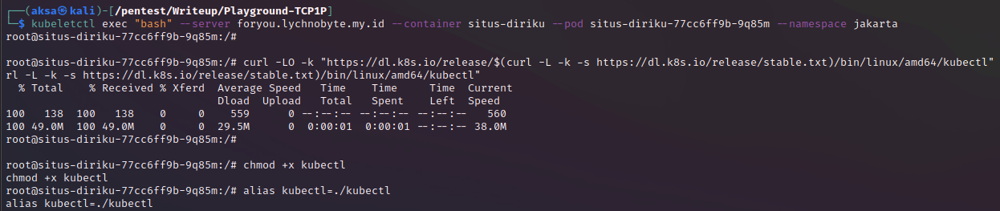

# That Day
## Description
703 points - Misc

Author: Lychnobyte

But perhaps you hate a thing and it's good for you And perhaps you love a thing and it's bad for you :')

<a href="http://foryou.lychnobyte.my.id">http://foryou.lychnobyte.my.id</a>

Hint: cloud challenge

## Solution

Pada soal ini kita diberikan tantangan untuk mengeksploitasi website `foryou.lychnobyte.my.id`. Jika kita kunjungi web tersebut maka akan menampilkan laman web pernikahan `dirinya` dan `dirimu`. Tidak ada kolom input maupun akses ke database yang terdeteksi pada web ini.

Oleh karena itu kita bisa lihat pada `hint` soal ini adalah `cloud challenge` yang artinya titik eksploitasi tidak jauh dari teknologi cloud. Mengacu dari `hacktricks cloud`, ada beberapa metodologi pentesting cloud yang bisa terjadi. Diantaranya Kubernetes Pentesting, GCP Pentesting, GWS Pentesting, AWS Pentesting, Azure Pentesting, dan Digital Ocean Pentesting. Sebetulnya masih banyak lagi namun dari beberapa cloud technology yang ada, semua yang disebutkan itu cukup masuk akal bila terdapat port yang terekspos sehingga kita bisa melakukan pentesting.

Dari referensi hacktricks itu kita dapat memulai pentesting dengan asumsi bahwa web menggunakan Kubernetes untuk orkestrasi containernya. Untuk detail terkait apa itu Kubernetes dapat dibaca <a href="https://kubernetes.io/">disini.</a> Terdapat beberapa port Kubernetes yang dapat kita uji apakah itu dapat jadi celah kita masuk ke sistem target. Berikut ini untuk list portnya.

| Port                | Process        | Description                                                             |
|---------------------|----------------|-------------------------------------------------------------------------|
| 443/TCP             | kube-apiserver | Kubernetes API port                                                     |
| 2379/TCP, 6666/TCP  | etcd           | etcd                                                                    |
| 4194/TCP            | cAdvisor       | Container metrics                                                       |
| 6443/TCP            | kube-apiserver | Kubernetes API port                                                     |
| 8443/TCP            | kube-apiserver | Minikube API port                                                       |
| 8080/TCP            | kube-apiserver | Insecure API port                                                       |
| 10250/TCP           | kubelet        | HTTPS API which full mode access                                        |
| 10255/TCP           | kubelet        | Unauthenticated read-only HTTP port: pods, running pods, and node state |
| 10256/TCP           | kube-proxy     | Kube Proxy health check server                                          |
| 9099/TCP            | calico-felix   | Health check server for Calico                                          |
| 6782/TCP - 6784/TCP | weave          | Metrics and endpoints                                                   |
| 30000-32767/TCP     | NodePort       | Proxy to the services                                                   |
| 44134/TCP           | Tiller         | Helm service listening                                                  |

Diantara semua list port itu ada satu yang menarik perhatian yaitu `kubelet` open port yaitu `10250/TCP`. Kubelet sendiri merupakan API atau komponen yang digunakan sebagai `agent` di cluster Kubernetes sehingga dapat memungkinkan adanya komunikasi antara `master` dan `worker` di cluster. Ini juga termasuk fungsi management pods dan service nya juga. Bila `kubelet` dibiarkan terbuka port nya alias `anonymous user` diperbolehkan akses `kubelet` maka dapat berpotensi injeksi yang berujung pada didapatkannya shell akses ke server Kubernetes. Kita dapat cek pada web soal ini dan benar akses `anonymous` di izinkan.
 

Karena sudah valid terdapat akses ke `kubelet API` kita dapat mengikuti langkah berikut untuk eksploitasinya.

1. Dari info di link <a href="https://www.deepnetwork.com/blog/2020/01/13/kubelet-api.html">ini.</a> Ada banyak path yang bisa digunakan pada `kubelet API`, salah satunya `/pods` yang digunakan untuk menampilkan informasi mengenai `pods` yang di deploy pada node.

2. Kalau kita eksplor informasi yang ditampilkan maka ada beberapa info penting seperti `kube secrets` dan `nama container` web ini yaitu `situs-diriku`.

3. Objek `secrets` khususnya pada `kube secrets` itu digunakan untuk menyimpan data rahasia seperti `kredensial` dan juga `Token key`. Namun agar kita bisa akses `secrets`, kita perlu akses ke shell terlebih dulu. Agar bisa berinteraksi dengan server lewat `kubelet` maka kita bisa memakai `kubeletctl` dari github <a href="https://github.com/cyberark/kubeletctl">ini.</a>

4. Kita hanya perlu instalasi tools `kubeletctl` sesuai arahan pada github repository tersebut.

5. Kalau sudah di install, kita dapat langsung coba lihat informasi pods dengan perintah `kubelet pods --server foryou.lychnobyte.my.id`.

6. Dari informasi yang ditampilkan, kita dapat gunakan info itu untuk menjalankan shell command pada container yang kita inginkan. Cukup dengan memasukan perintah `kubeletctl exec "<command nya>" --server foryou.lychnobyte.my.id --container situs-diriku --pod <nama pods nya> --namespace jakarta`. Contoh untuk command `ls` maka akan seperti ini.

7. Selanjutnya, untuk dapat akses shell server. Kita dapat gunakan saja perintah `bash` untuk akses ke shell `bash` nya.

8. Setelah masuk ke server, kita perlu menggunakan `kubectl` untuk berinteraksi ke setiap objek di Kubernetes cluster. Tapi sayangnya, `kubectl` belum terinstall. Oleh karena itu kita install saja mengikuti step di link <a href="https://github.com/matt-bentley/KubernetesHackDemo#kubectl">ini.</a>

9. Kemudian, agar bisa akses informasi `kube secrets` kita memerlukan `token`. Info token sendiri terletak di file `/var/run/secrets/kubernetes.io/serviceaccount/token` sesuai info dari path `/pods` sebelumnya.

10. Langsung saja kita list semua `kube secrets` yang ada dengan perintah `kubectl --token=$(cat /var/run/secrets/kubernetes.io/serviceaccount/token) get secrets`. Dari hasil tersebut didapati ada `secrets` bernama `secret-diriku` dan bila kita lihat isinya dengan perintah `kubectl --token=$(cat /var/run/secrets/kubernetes.io/serviceaccount/token) get secret secret-diriku -o yaml` kita bisa dapati sebuah teks ter encode base64 disitu.

11. Terakhir, kita decode saja teks mencurigakan itu dan voila flag didapatkan.

## Catatan
Untuk mencegah kerentanan ini terjadi, sebetulnya kita bisa melakukan beberapa hal:
1. Hilangkan akses `anonymous` bila ingin `kubelet API` ter ekspos ke publik.
2. Batasi port kubernetes yang terbuka khususnya port yang berhubungan dengan database seperti `etcd` dan akses management cluster seperti `kubelet`.
3. Gunakan autentikasi untuk setiap akses ke `kubelet API` apabila ingin tetap dibuka untuk akses remote.

## Reference
- https://github.com/matt-bentley/KubernetesHackDemo
- https://github.com/cyberark/kubeletctl
- https://cloud.hacktricks.xyz/pentesting-cloud/kubernetes-security/pentesting-kubernetes-services

