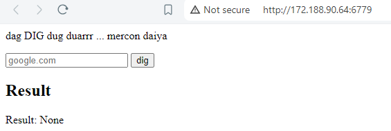
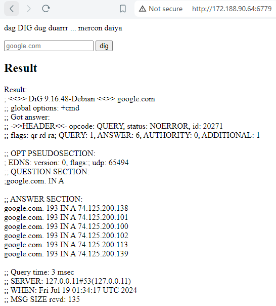
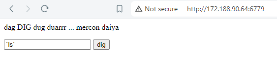
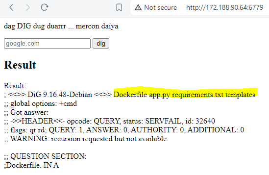
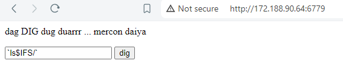
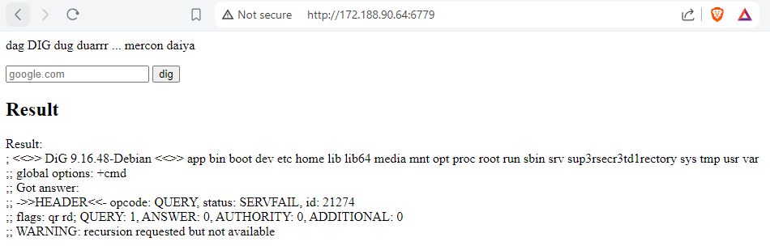
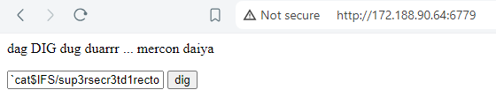
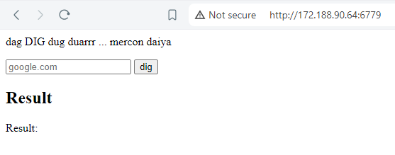
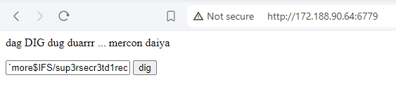
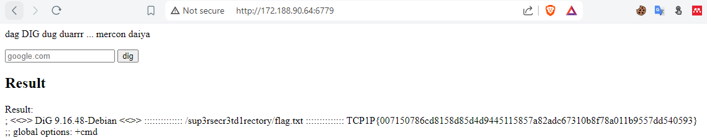

# oscommand
## Description
20 points - Web

Author: 53buahapel

Flag folder is in / directory. Find a way to get it.

restricted: [';', '&', '|', '||', '&&', '>', '<', '(', ')', '{', '}', '[', ']', '\', ''', '"', '!', '*', '?', '~', '#', '%', '+', ' ']

Connect: <a href="http://172.188.90.64:6779">http://172.188.90.64:6779</a>

## Solution

1. Pertama, kita dapat akses web nya dan disini kita dihadapkan pada tampilan web yang meminta input dan sebuah tombol dig.

   

3. Kalau dari hint contoh input dan juga tombol bertuliskan `dig`, ini dapat diduga kalau input kita dapat berupa link yang nantinya akan dimasukan ke belakang command `dig`.

   

5. Dari output itu kita bisa tau kalau benar di web ini meminta kita memasukan sesuatu yang nantinya bakal ditambahkan ke belakang command `dig`. Contoh jika input kita google.com maka nantinya di web akan menjalankan perintah berikut. 

    ```bash
    dig google.com
    ```

6. Command `dig` berfungsi untuk melihat lookup dns. Kalau dilihat dari sisi injeksi keamanan, kita dapat mengkategorikan ini dalam serangan command injection.

7. Kita bisa lihat juga ada beberapa keyword yang di blokir sesuai info di deskripsi soal.

8. Namun ada beberapa karakter yang tidak di blokir salah dua nya adalah backticks (`) dan percent symbol ($).

9. Dengan info itu kita bisa coba crafting payload, pertama kita coba memakai backticks (`) untuk membuat teks dijalankan sebagai teks yang nantinya dijalankan sebagai sebuah command shell.

    

    

10. Karena payload sebelumnya berhasil, kita coba lihat di root directory.

    

    

11. Ternyata ada folder yang menyimpan `flag.txt`. Kalau kita coba lihat pakai command `cat` nantinya hanya akan muncul blank output saja yang nandain kalau command tidak berjalan (entah di blokir atau tidak ada command nya).

    

    

12. Agar kita bisa melihat isi file `flag.txt`, kita bisa manfaatkan command lain yang digunakan untuk melihat file yaitu `more`.

    

    
